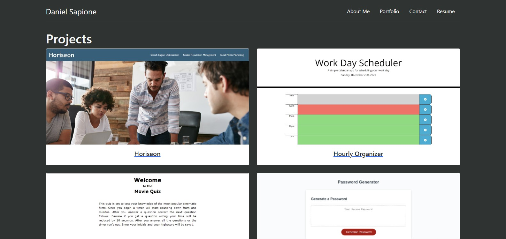

# React Portfolio

## Description

A portfolio built from scratch to show my skills in React. The site is built to be browser accessible and have a responsive design.

## Table of Contents

* [Installation](#installation)
* [Usage](#usage)
* [Contributing](#contributing)
* [Tests](#tests)
* [Questions](#questions)

## Installation

You will need to have node.js installed, and run 'npm i' on the cmd line so inquirer will download after you clone the repo.

## Usage

The application is deployed to GitHub pages please visit [My Portfolio](https://dsapione.github.io/react-portfolio/) to use the app.

## Contributing

Follow best practices

## Tests

No tests at the moment

## Questions

If you have an questions feel free to contact me via [Email](dsapione@gmail.com)
and checkout my other projects on [GitHub](https://github.com/dsapione).
